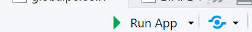

# M1-Programmation-S1

# Description courte du projet 
<br>
Ce dossier a pour but de permettre de lancer une application qui va automatiser l'exécution de tests statististiques , permettant de sélectionner des données de qualité , autant que des liaisons entre les variables significatives. De plus, il est également proposé de pouvoir comparer par la suite des modèles de régression, à partir des données utilisées. <br>

Deux éléments **cruciaux** à ne surtout pas oublier : le support des applications est beaucoup plus élevé en activant l'option **ouvrir dans un navigateur** que dans un autre navigateur sur Rstudio, et d'ailleurs , élément beaucoup plus simple, le flexdashboard qui affiche les deux applications dans la partie test est disponible à ce lien.

<br> Le lien est disponible ici : https://lerenardprogrammeur.shinyapps.io/DiaporamaProjetRshinyFinal/ 

# Structure des dossiers et des fichiers du Github 

Ainsi, le code R permet de lancer directement chacune des applications Shiny, que ce soit celle de performance du modèle ou celle de tests statistiques . <br>
Ensuite, le code Rmarkdown , permet de créer un dashboard interactif, qui permet donc d'intégrer autant les applications RShiny que l'explication du code en lui-même, dans ses grandes lignes. <br>
Enfin, ce readme permet de rapidement lancer correctement l'application . <br>

## Pré-requis : installation des packages nécessaires. 
Le 1er pré-requis est d'avoir la version de Rstudio la plus récente, ainsi que les packages nécessaires, rappelés ci-dessous. 
Le document R ou Rmarkdown contient normalement cette étape, voici un code similaire si vous avez loupez cette étape. De nombreux packages sont nécessaires afin de pouvoir effectuer les tests statistiques. 
L'application a été réalisée sous l'IDE Rstudio, qui a également créé le langage Rshiny, son téléchargement est donc recommandé. 
Ainsi , il vous suffit de copier ces lignes de code afin d'installer les packages nécessaires et de pouvoir lancer l'application avec l'onglet run .

```r 
 #Liste des packages requis
packages_requis <- c("rstatix", "DescTools", "stats", "shiny", "shinyjs", "DT", "rintrojs")

### Fonction pour installer et charger les packages
installer_et_charger <- function(packages) {
  for (pkg in packages) {
    if (!require(pkg, character.only = TRUE)) {
      install.packages(pkg, dependencies = TRUE)
      library(pkg, character.only = TRUE)
      message(paste("Le package", pkg, "a été installé et chargé."))
    } else {
      message(paste("Le package", pkg, "est déjà installé et chargé."))
    }
  }
}

### Exécution de la fonction
installer_et_charger(packages_requis)

### Installation du code R et lancement des applications.
Pour la seconde application, voici la liste de packages à installer.

library(shiny)
library(dplyr)
library(car)       
library(broom)  
library(stringr)  
library(leaps)    #Sélection logistique en régression multiple. 
library(bestglm)   # pour Sélection exhaustive 
library(glmnet)    # pour Elastic Net / Lasso / Ridge

```
On a également ce package à installer, si vous souhaitez accéder au diaporama interactif. 
```
install.packages("flexdashboard")
library(flexdashboard)
```
Ces étapes permettent de s'assurer que l'ensemble des packages ont été chargés afin de pouvoir lancer correctement les deux documents. 

# Lancer les fichiers .R pour accéder aux applications Shiny.  
Ce tutoriel a été réalisé à l'aide de Rstudio. 

## Lancer le fichier R après téléchargement ! 

Après avoir téléchargé sur Github le fichier R "Logicieldetestsstatistiques.R", il vous suffit de le lancer avec un IDE choisi. 

## Détection de Rshiny : vérifier la présence du bouton Run App 
Si Rshiny a déjà été installé et chargé , ce qui signifie que vous avez donc suivi l'étape suivante d'installation des packages, il devra s'afficher normalement un bouton supplémentaire, à côté du run, dénommé Run App, comme indiqué ici sous Rstudio. 

Voici une capture d'écran de l'icône qui est censé apparaître et qui permet de lancer directement l'application au format html.



#### Lancer l'application de statistiques  en appuyant sur "Run app" ! 


## 3.Lancer le fichier Rmarkdwon "DiaporamaProjetRshinyFinal.rmd : une présentation interactive.  
Ainsi de lancer le diaporama Rmarkdown, réalisé avec flexdashboard, il est important de télécharger d'abord flexdashboard et de vérifier qu'il est bien exécuter. 
Ensuite, il devrait , après avoir chargé le fichier DiaporamaProjetRshinyFinal.rmd, avoir la possibilité de lancer le diaporama interactif en appuyant sur "RUN document" "",

Normalement, la présentation devrait s'afficher sur un fichier html à part ; ce qui permet l'interactivité.
Il  permet ainsi d'insérer l'application entière en elle-même, facilitant les explications des exemples d'utilisation. 

### 4 : Attention :pour un affichage correct, choisir l'affichage sur le navigateur. 
En effet, uniquement sur le navigateur Edge, on peut avoir l'ensemble du contenu qui est affiché. Il s'agit d'un bug qui est potentiellement lié à l'habitude d'avoir un tableau interactif sur un navigateur, et non dans le viewer de Rstudio (potentiellement). 
<br>


# Exemples d'utilisation de l'application Rshiny "Logicieldeteststatistique"
Tout d'abord, on peut souligner que les deux applications sont fusionnées dans le diaporama/page interactive , que l'on peut lancer à partir du fichier markdown. 
Ainsi, les deux applications peuvent être lancées simultanément, en lançant qu'un seul document également. En effet, il n'est pas possible de lancer deux applications Rshiny en même temps. 

## 1er posssibilité   : comparer une moyenne d'échantillon avec une moyenne de population : la valeur de référence. 

La première application de statistiques automatisées ;dans le cadre notamment de tests de différences de moyennes  entre deux populations. Cela permet notamment de savoir si on a un échantillon représentatif de la population générale par exemple. 

### 1ere  étape:  Sélection de l'utilisateur 

Afin de pouvoir effectuer le test, l'utilisateur doit choisir en premier la moyenne d'échantillon (Y) et en deuxième, la moyenne de population avec la possibilité de mettre une valeur de référence (X). 
Par exemple H0  : mu0=Mu1 si l'échantillon est représentatif. 
H1 : où valeur de référence rentrée par l'individu mu0. De plus, la valeur mu1, est notamment celle de la moyenne de la variable.

### 2eme étape : définir le type de variable sélectionné et trouver automatiquement le test statistique. 
Après avoir lancé l'application, l'application Shiny permet notamment de sélectionner le test statistique qui sera le plus approprié. 
Ainsi, le 1ere critère sera par exemple le respect de l'hypothèse de normalité de la variable Y . Un texte s'affiche automatiquement afin d'indiquer à l'utilisateur si la variable Y suit une loi normale ou pas. Ainsi, cela permet de savoir si on va utiliser un test paramétrique (distribution normale) ou non paramétrique. 

Ensuite, entre en jeu le type de variable Y : si la variable est binaire, quantiative ou multinomiale.Certains tests , en effet, notamment paramétriques, reposent d'emblée sur les régressions sous-jacentes. Ensuite, la variable X , explicative est choisie :elle peut être dichotomique, quantitative ou catégorielle.Cela permet ainsi d'effectuer le test statistique adéquat, et de mettre en place des étapes, parfois oubliées, comme le respect des hypothèses. 
<br>
### 3.Résultat final
Le résultat final du test est alors affiché dans le cadre. Afin de pouvoir afficher l'ensemble des résultats de chaque test (intervalles de confiances, degrés de libertés...), qui sont souvent propres à chaque test statistique, j'ai décidé de garder l'encadré originel. 
<br>

## 2eme possibilité : tester la significativité entre les variables . 
Il suffit cette fois-ci pour l'utilisateur de sélectionner la variable expliquée et explicative , ce qui permet donc de tester la significativité. 
<br>

# 3eme application : comparer des modèles de régression statistique 

Effectivement, il est possible de comparer toutes les combinaisons de variables explicatives entre elles, afin de trouver la spécification qui va amener la meilleure performance du modèle.
<br>
Ainsi, après avoir sélectionner la base de données, puis la variable Y , voire déjà les variables explicatives qui vont servir à l'analyse en générale (1er onglet), l'utilisateur peut cliquer sur l'onglet intitulé modélisation automatique, qui fait un test de VIF de multicolinéarité et permet également d'afficher des régressions. 
<br>
Ensuite dans le 4eme onglet, on y retrouve la possibilité de faire une sélection par la méthode la plus répandue, celle de l'elasticnet qui effectue notamment une minimisation de la multicolinéarité parfaite autant qu'une annulation des variables non significatives. 
<br>
Enfin, la recherche exhaustive, qui pourrait permettre dans de nombreux cas , accéder à une spécification du modèle plus aboutie,consiste en une comparaison des RCarrés de l'ensemble des régressions possibles à l'aide d'une tableau croisé de variables, de façon aléatoire. 

# Utilisation rapide 
### Charger le fichier R
### Mettre en place les données. 
Les données peuvent être chargées sous différents formats : R, csv....

### Comparer les performances : la comparaison des performances (R2, Fischer...) entre différentes régresssions multiples, logistiques , avec sélection individuelle des variables. 

 
Ainsi, la partie de tests statistiques permet essentiellement de vérifier la qualité des données, avant de pouvoir les utiliser. 
De plus, une seconde partie a été ajoutée, dans la continuité de la 1ere , qui permet notamment de comparer la performances des modèles. 

Au final, le but essentiel est  de pouvoir améliorer les choix en matière de données d'un côté, en tentant de comparer des échantillons avec les moyennes nationales par exemple et  par la suite, d'améliorer également la phase de modélisation . En effet, on peut ainsi charger n'importe quelle base de données et pouvoir effectuer rapidement et facilement plusieurs régressions. 


# Cadre du projet
Ce travail a été effectué dans le cadre d'un projet en Master DS2E à Strasbourg durant le 1er semestre de 2024 par Grégoire Fuchs . 
Il sera présenté le 14 Janvier 2025. 


# Prérequis 
#1er prérequis : avoir une  base de données ou pour s'entraîner, garder celle qui est préchargé de mtcars. 
<br>
La base de données mtcars, qui est une base de données qui décrit les caractéristiques de nombreuses voitures est d'emblée pré-chargée. 
Lorsqu'un utilisateur souhaite charger une autre base de données, il doit l'importer sous formes de bases de données au format csv , .txt, .xslx, .rds, .sas7dat,.sav. Ainsi, la majorité des formats de base de données sont acceptés. 


Afin de pouvoir charger  les packages, il est important d'installer avant l'ensemble des packages nécessaires. 


# Construit avec 
-Rshiny
-Rmarkdown
-Flexdashboard
-de nombreux packages de tests statistiques : Rstatix, 


# Auteur
Grégoire Fuchs 

# Remerciements

* Un grand merci à tous les utilisateurs ! 
# Sources 
Tutoriels R shiny github
Tutoriels Flexdashboard 
